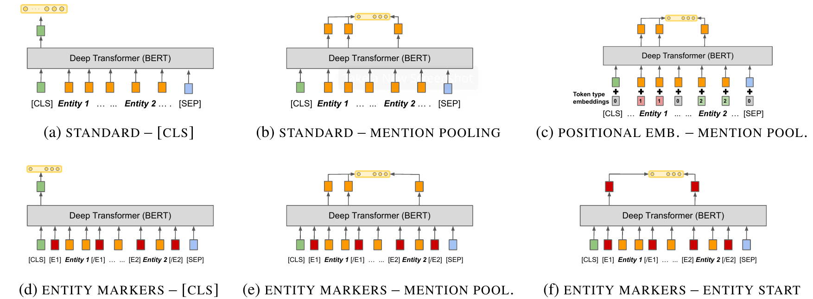

# MTB
Implementation of the first part in the "Matching the Blanks" (MTB) paper.



## Installation
```bash
git clone git@github.com:chen-yuxuan/MTB.git
cd MTB
pip install -e .
```

## Usage
To evaluate the default setting (i.e. `model="bert-base-cased", variant="f", max_length=128, batch_size=64, num_epochs=5, lr=3e-5, dropout=0.1`), run:
```bash
python main.py
```

To run your own setting, for example do:
```bash
python main.py variant=a model="bert-large-uncased" batch_size=32 num_epochs=10
```

Hydra provides a simple way to sweep the arguments for hyperparameter-finetuning. The following command will excute 3 * 2 * 1= 6 runs in a row:
```
python main.py batch_size=32,64,128 variant=b,e,f max_length=512
```

To show the available options and the default config, do:
```bash
python main.py --help
```
which results in something like this:

```
== Configuration groups ==
Compose your configuration from those groups (group=option)


== Config ==
Override anything in the config (foo.bar=value)

seed: 1234
cuda_device: 0
train_file: ./data/tacred/train.json
eval_file: ./data/tacred/dev.json
model: bert-base-cased
variant: d
max_length: 128
batch_size: 64
lr: 3.0e-05
num_epochs: 5
dropout: 0.1
```


## Results
### TACRED (with `bert-base-cased`)
- Fully-supervised

|Variant|Max-length|Micro F1-score (%)|
|:-:|-:|-:|
|a|128|23.5|
|b|512|64.8|
|d|128|67.7|
|e|512|67.5|
|f|512|67.9|

- Few-shot

### SMiLER

### FewRel


## Citation
```
@inproceedings{baldini-soares-etal-2019-matching,
    title = "Matching the Blanks: Distributional Similarity for Relation Learning",
    author = "Baldini Soares, Livio  and
      FitzGerald, Nicholas  and
      Ling, Jeffrey  and
      Kwiatkowski, Tom",
    booktitle = "Proceedings of the 57th Annual Meeting of the Association for Computational Linguistics",
    month = jul,
    year = "2019",
    address = "Florence, Italy",
    publisher = "Association for Computational Linguistics",
    url = "https://aclanthology.org/P19-1279",
    doi = "10.18653/v1/P19-1279",
    pages = "2895--2905",
    abstract = "General purpose relation extractors, which can model arbitrary relations, are a core aspiration in information extraction. Efforts have been made to build general purpose extractors that represent relations with their surface forms, or which jointly embed surface forms with relations from an existing knowledge graph. However, both of these approaches are limited in their ability to generalize. In this paper, we build on extensions of Harris{'} distributional hypothesis to relations, as well as recent advances in learning text representations (specifically, BERT), to build task agnostic relation representations solely from entity-linked text. We show that these representations significantly outperform previous work on exemplar based relation extraction (FewRel) even without using any of that task{'}s training data. We also show that models initialized with our task agnostic representations, and then tuned on supervised relation extraction datasets, significantly outperform the previous methods on SemEval 2010 Task 8, KBP37, and TACRED",
}
```